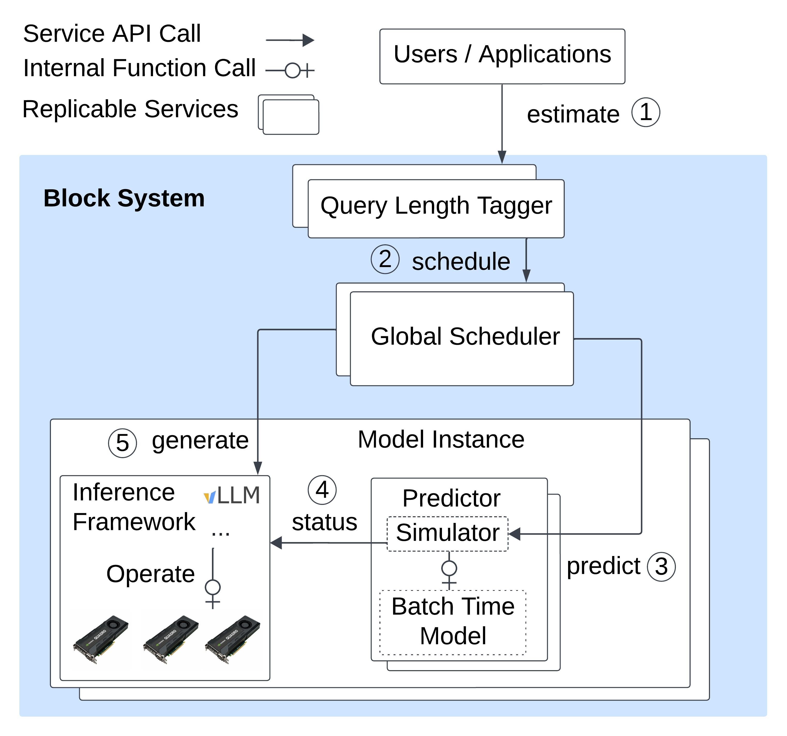

# Block

**Block: Balance Loader of LLM Serving with Context
and Knowledge For Predictive Scheduling**

Block is a research prototype that explores *predictive, performance-aware scheduling* for distributed large-language-model (LLM) inference.
It builds on top of Microsoft’s [Vidur](https://github.com/microsoft/vidur) simulator, which initially developed for offline evaluation and optimal configuration searching and adds

* a side-car *Predictor* service that forecasts per–instance leading metrics with Vidur at run time,
* a *Global Scheduler* that uses these predictions (or live metrics) to route requests, and
* tooling for training a light-weight length-estimator model so the scheduler can reason about prompts it has never seen before.

Everything needed to reproduce the paper’s results—source code, datasets, experiment scripts—lives in this repository and is anonymised for the reviewing process.

---

## 1. Architecture at a Glance



• **Predictor** (`block/predictor`)
 Co-locates with every inference node. Collects live stats, or spins up a Vidur simulation on-demand, and answers *“What if I got one more request?”*

• **Global Scheduler** (`block/global_scheduler`)
 Receives requests, queries Predictors, and applies the scheduling policy (default: Block; alternatives: LLumnix, round-robin, …).

• **Query Length Tagger** (`block/length_estimation`)
 A RoBERTa-based regressor that predicts the response-token count for unseen (model, prompt) pairs, feeding the scheduler with input-aware cost estimates. Currently, we just run this model offline to tag the ShareGPT dataset with predicted response length in `data/trace_data/sharegpt/generate` but it should be easy to adapt to any runtime model service as tf-serving or TorchServe.

Block is inference-engine agnostic. We provide an implementation for vLLM 0.7.2 (see the sealed repo at https://anonymous.4open.science/r/vllm-644A).

---

## 2. Repository Layout

```
block/
 ├── predictor/             # side-car prediction service
 ├── global_scheduler/      # request router
 ├── length_estimation/     # training & inference of token-length regressor
 ├── benchmark/             # Poisson load-generator (forked from vLLM)
 ├── config/
 │     └── host_configs.json# cluster description template
 ├── exp/
 │     ├── generate_config.py
 │     ├── setup.sh         # installs deps & deploys cluster
 │     ├── end_to_end_exp_scripts/
 │     └── …                # run, plot, gather
 └── data/                  # ShareGPT, BurstGPT, ArXiv-Summ datasets

vidur # Same as original vidur repo but with new replica scheduler/revised simulator
 ├──  ...
 ├── scheduler
 	 ├── sarathi_replica_scheduler.py # vLLM scheduler simulator with chunked prefill
	 ├── simulate_predict_replica_scheduler.py # class to adapt other simulators/latency linear model into Predictor Service
	 └── …                # other simulators
```

---

## 3. Quick Start

1. Set up cluster
2. Generate the cluster hosts configuration
   
   If using cloudlab, just download its manifest.xml and moved to block/prediction
   
   ```
   python block/exp/generate_config.py --username USERNAME_SSH_TO_HOST
   ```
   
   Otherwise, need to manually generate configration and hostname listing files as examples under block/config.
3. Deploy software stack and vLLM build
   
   ```bash
   sh block/exp/setup.sh
   ```
   
   Insert the vLLM github link if missing or manually distributed vLLM repo to testing workers
4. Start a full end-to-end experiment (≈50 h on 12 × A30 GPUs)

   Fill your Hugging Face token in `exp/run_exp_vllm.sh` and the hostname to run the global scheduler and benchmarking at `exp/experiment.sh`.
   
   And run all end-to-end scripts like
   
   ```bash
   sh block/exp/end_to_end_exp_scripts/main_experiments.sh
   ...
   # results under experiment_output/data/
   ```
 All testing scripts are located in the `block/exp/end_to_end_exp_scripts` directory. These scripts can be used to reproduce different experiments as follows:
 
 - **`main_experiment.sh`**: Generates results for **Figure 6** (refer to **Section 5.3**).
 - **`auto_provision_exp.sh`**: Produces results for **Figure 8** (refer to **Section 5.5**).
 - **`config_search_experiment.sh`**: Used for testing with different batch size and chunk size, corresponding to **Table 2** (refer to **Section 5.6**).
 - **`extension_experiment.sh`**: Tests with the Qwen model and the BurstGPT dataset, also related to first 2 columns in **Table 2** (refer to **Section 5.6**).
 - **`prediction_experiment.sh`**: Provides results for debugging prediction accuracy **Figure 5** (refer to **Section 5.2.2**).
 - **`warmup.sh`**: Uswd for simple experiments and debugging, facilitating and warm-up models for other experiments
   
	
6. Plot and summarise results after all above experiments finished 
   
   ```bash
   sh block/exp/end_to_end_exp_scripts/plot.sh
   # figures end up in experiment_output/results/
   ```
---

## 4. Train / Evaluate the Length Estimator

If you wish to regenerate the regressor instead of using the provided tagged data.

Download the dataset from

```
wget https://huggingface.co/datasets/shibing624/sharegpt_gpt4/blob/main/sharegpt_gpt4.jsonl
```

And train and generate the tagged data

```bash
python block/length_estimation/sample 
python block/length_estimation/train_roberta
# Tag ShareGPT prompts with ground-truth response lengths 
python block/length_estimation/eval_roberta --tag-data True
```

---

## 5. Benchmarking with Other dataset

`block/benchmark_serving`, which modified from vLLM benchmark scripts can replay JSON/CSV dataset at a configurable Poisson arrival rate

```bash
python block/benchmark/benchmark_serving.py
```

---

## 6. Extending Block to new Scheduler and Model

• Add a new scheduling heuristic: 1) implement from inference side to export required metrics to Predictor (checking vLLM latest commits), and 2) define its load scores as inside `simulate_predictor.py. predict` 3) Append the name of new scheduler under static enum class `vidur/types/optimal_global_scheduler_target_metric.py` and update inside e2e shell scripts

• Support a different inference engine: expose the metrics in a new API, taking the `scheduler_trace` in vLLM `vllm/entrypoints/api_server.py` at the vLLM implementation as an examples.

• Support different models with different GPU SKUs 
 1. please following the [Vidur instruction](https://github.com/microsoft/vidur/blob/main/docs/profiling.md) to gather the profiling data and moved to `data/profiling`
 2. Append the new model configurations at `vidur/config/model_config.py`. Currently we only profiled the cloudlab d7525 host (with single A30 GPUs) with Qwen2-7B and Llama-2-7B-hf for prototyping.
 3. Provide a new model config for global scheduler to use, following the `block/config/llama_config.json` as an example and update the end-to-end scripts to use the new model config according, checking '/block/end_to_end_exp_scripts/entension' which run the experiments on Llama2 and Qwen2 both.
 4. Finally, if using a estimated length associated with the new model ( as Block* in the paper), following above steps to train/evaluate the length estimator to get the tagged data and put it under `data/trace_data/DATASET_NAME/generate/MODEL_NAME/`

---

## 7. Requirements

It was tested with this set of packages

• Python 3.10

• CUDA 12.6

• flashinfer-python 0.2.5 and triton 3.2.0, PyTorch-2.5+, customized vLLM based on 0.7.2

Plase checking requirments.txt and `block/exp/setup.sh`

---

## 8. Citation

If you find Block useful, please cite our arXiv pre-print:

```
@misc{block2024,
  title   = {Block: Balance Loader of Language-Model Instances with Context and Knowledge},
  author  = {Anonymous},
  year    = {2024},
  url     = {https://anonymous.4open.science/...},
}
```

---

## 9. License

This work is released under the MIT license. See `LICENSE` for details.

Happy scheduling!
